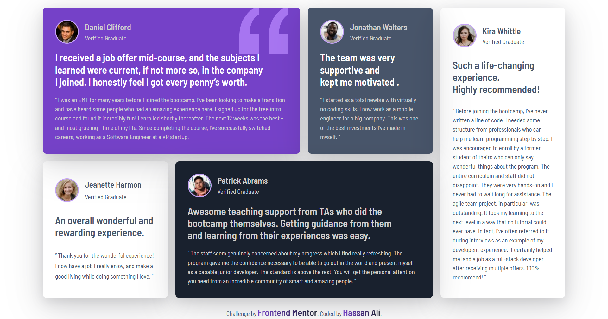
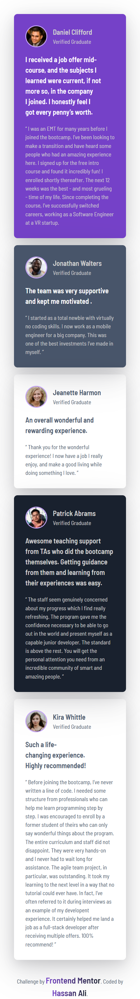

# Frontend Mentor - Testimonials Grid Section Solution

This is my solution to the [Testimonials Grid Section](https://www.frontendmentor.io/challenges/testimonials-grid-section-Nnw6J7Un7) challenge on Frontend Mentor.  
Frontend Mentor challenges help you practice building realistic, production-ready layouts.

---

## 📌 Overview

### 🔹 The Challenge

Users should be able to:

- View the **testimonials grid** layout optimally depending on their device’s screen size.
- Experience a clean, semantic, and accessible testimonial section.
- Appreciate responsive design that adapts without breaking.

---

## 🖼️ Screenshots

### Desktop

### Mobile

---

## 🌐 Live Demo

👉 [View Live Demo](https://hassan-ali-byte.github.io/testimonials-grid-section-main/)

---

## ⚙️ My Process

### Built With

- ✅ Semantic **HTML5 markup** (`<section>`, `<article>`, `<blockquote>`)
- 🎨 **CSS custom properties** for colors and spacing
- 📐 **CSS Grid** (main focus of this project)
- 📱 **Mobile-first workflow** for responsiveness

---

## 📚 What I Learned

This challenge helped me strengthen my understanding of **CSS Grid**:

- Practiced both **grid-template-columns/rows** and **grid-template-areas**, and found **areas** much easier and more readable for this type of layout.
- Focused on **base styling using grouped selectors**, reducing repetitive CSS.
- Kept the structure **simple and semantic**, avoiding unnecessary wrappers.

---

## 🔗 Resources

- [Josh Comeau – CSS Reset](https://www.joshwcomeau.com/css/custom-css-reset/) → Helped me establish a clean base.
- [Kevin Powell – CSS Grid deep dives](https://www.youtube.com/@KevinPowell) → Great learning resource for understanding Grid layouts.

---

## 📂 Extra Notes  

For study purposes, I’ve also included a separate file: **learning.css**.  
This file contains my experimental attempts with **grid-template-columns/rows** before I settled on using **grid-template-areas** in the final solution.  

It’s not linked to the HTML — it’s only there for personal learning and future reference.  

---
## 👨‍💻 Author

**Hassan Ali**

- Frontend Mentor – [@hassan-ali-byte](https://www.frontendmentor.io/profile/hassan-ali-byte)
- GitHub – [hassan-ali-byte](https://github.com/hassan-ali-byte)

---

✨ Thanks for checking out my solution!  
Feedback and suggestions are always welcome 🙌
